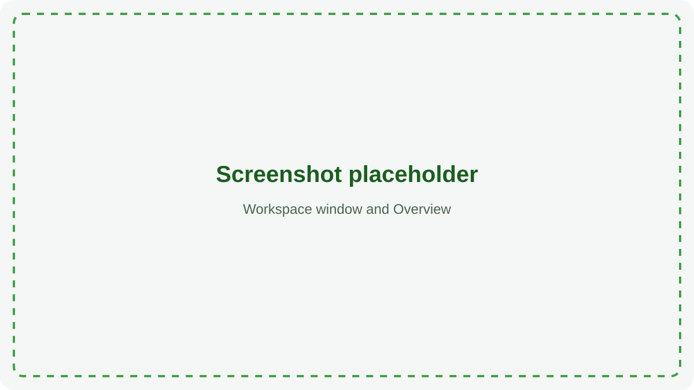
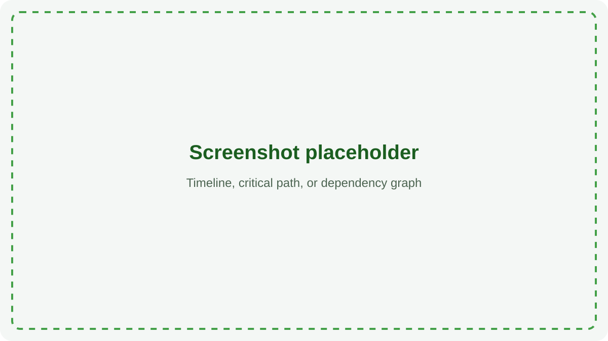
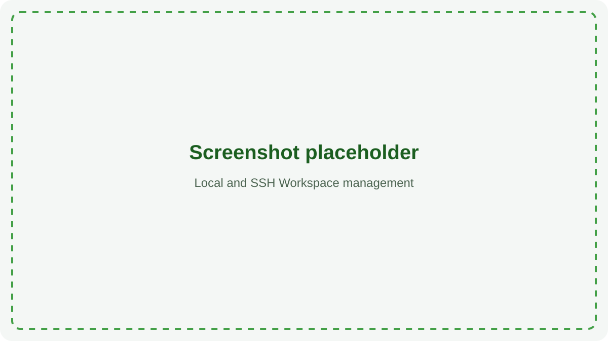

# Bazel Build Visualizer

Bazel Build Visualizer is a local-first desktop app for understanding what a
Bazel build did and where it spent its time. It can run builds locally or on a
Linux host over SSH, capture their Build Event Protocol data, and turn that
data into searchable tables, timelines, dependency graphs, critical paths,
and performance findings.

The app preserves the original capture before deriving results. Missing data
is shown as unavailable, and incomplete captures remain inspectable without
being presented as complete.

## Quick start

1. Install [Bazelisk](https://github.com/bazelbuild/bazelisk). On macOS:

   ```bash
   brew install bazelisk
   ```

2. From the repository root, start the app:

   ```bash
   bazel run //app
   ```

3. Create a local Workspace, select a Bazel repository, and run a command from
   **Console**. The app shows the effective command and every added capture
   flag before the build starts.

Bazelisk selects the version in `.bazelversion`, and Bazel downloads the Java
toolchain. A separate JDK installation is not required for this workflow.



## Features

### Available in the first release

- Capture local builds through an embedded, loopback-only Build Event Service.
- Run builds on Linux hosts through saved SSH Workspaces and reverse tunnels.
- Open several local or remote repository Workspaces in independent windows.
- Import binary or JSON BEP files and share portable `.bviz` session archives.
- Explore actions, top-level and configured targets, configurations, tests,
  errors, events, files, and evidence-backed findings.
- Inspect full-build timelines, Bazel and derived critical paths, dependency
  trees, and bounded dependency graphs.
- Profile Starlark CPU use with hot-function, caller/callee, graph, and flame
  views.
- Enrich sessions with execution logs, trace profiles, `aquery`, and `cquery`.
- Query normalized session data with a syntax-aware SQL editor.
- Browse and edit local or remote repositories, and use a persistent terminal
  for each Workspace.
- Choose and persist the Bazel executable, as a command name or path, for each
  Workspace.
- Choose a persistent UI theme and collect bounded diagnostic logs at several
  verbosity levels.
- Page and render large captures without loading the whole build into memory.



### Planned

- Compare sessions and match equivalent actions across builds.
- Highlight duration, cache, action-key, and input-size regressions.
- Forward captured events to an existing enterprise BES and inspect historical
  BES data.
- Add build annotations, shared reports, custom metric plugins, and IDE
  integration.
- Add automated performance-regression detection and headless report
  generation.

See the [deferred roadmap](docs/product-plan.md#28-deferred-roadmap) and
[implementation status](docs/implementation-status.md) for the current source
of truth.

## Workspaces and sessions

A **Workspace** identifies one repository and the machine where commands run.
It may be local or an OpenSSH destination. Saved Workspaces remember their
repository settings and Bazel executable. Every Workspace has command
history keyed by its stable identity. A discovered Workspace can reach its
bounded history and Bazel executable override only when the optional discovery
script emits it again; the discovered profile itself remains ephemeral. Each open
Workspace has its own Console, Terminal, repository browser, editors, and
captured-session selection. Within one window, Ctrl+Tab and
Ctrl+Shift+Tab cycle down and up its left navigation, with wrap.

A **session** is the preserved record of one build. Opening an old session does
not reconnect to its original machine. Local and remote captures use the same
analysis views after their files reach the managed session directory.

SSH authentication, host keys, jump hosts, identities, and aliases remain in
the user's OpenSSH configuration or agent. The app does not store passwords or
private keys. See the [user guide](docs/user-guide.md) for Workspace setup,
capture, navigation, and sharing.



## Capture and analysis

Managed builds are instrumented with disclosed Bazel flags for BEP capture and,
when supported, execution logs, trace profiles, query graphs, and Starlark CPU
profiles. Raw event bytes are journaled before decoding and normalization.
Derived data records its source and completeness so an observed execution is
not confused with a declared action or configured-target graph.

The project has been exercised against Bazel 6.5, 7.6, 8.4, and 9.2. The
desktop release is macOS-first; remote execution targets Linux through system
OpenSSH. See [Bazel compatibility](docs/bazel-compatibility.md),
[capture sources](docs/capture-sources.md), and the
[architecture overview](docs/architecture.md) for details.

## Command-line tools

The same application target provides import, inspection, and managed-run
commands:

```bash
bazel run //app -- import path/to/build.bep
bazel run //app -- inspect path/to/session --events 20
bazel run //app -- run -- build //...
```

To build a single runnable jar:

```bash
bazel build //app:app_deploy.jar
```

macOS application images and disk images are described in
[docs/packaging.md](docs/packaging.md).

## Development

Use scoped targets while iterating. The normal repository-wide gate is:

```bash
bazel build //...
bazel test //... --test_tag_filters=-bazel-sweep
```

The `bazel-sweep` tests start several Bazel servers and are intentionally
excluded from the normal gate. Java builds run Error Prone and verify Google
Java Format. Format sources with:

```bash
bazel run //tools:format_java
```

## Documentation

- [User guide](docs/user-guide.md) — Workspaces, capture, analysis, and sharing
- [Implementation status](docs/implementation-status.md) — completed behavior
  and known gaps
- [Architecture](docs/architecture.md) — modules, data flow, graphs, and
  threading
- [Performance](docs/performance.md) — scale targets and measurements
- [Bazel compatibility](docs/bazel-compatibility.md) — verified versions and
  version differences
- [Privacy and security](docs/privacy.md) — network and data-handling boundaries
- [Troubleshooting](docs/troubleshooting.md) — common setup and runtime issues
- [Architecture decisions](docs/adr/) — accepted design decisions
